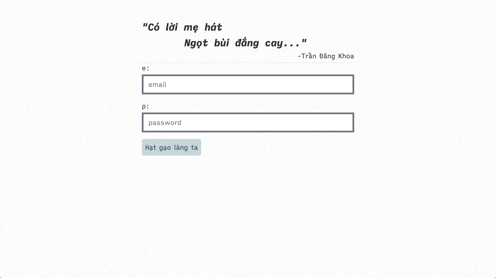

# Quick start

## Features

This is an invitation-based application, so:

- No REGISTRATION page
- This is a chat app btw 😅

I will continue to develop this from time to time, mainly adding WebRTC for video calling and share screen 👍🏻

## Goals

- [x] Learn more about subscriptions
- [ ] Create a finished web (from `back` to `front`)
- [ ] Do files uploading

## Requirements

You need to have

- A postgresql database
- A redis database
- Nodejs (and also Yarn)

## Running

- Run `yarn` inside the `./client` and `./server` folder
- Provide the `.env` inside `./server` with the necessary information:
  - `DATABASE_URL`: the url to the postgres database
- ...

## WIP

The login page:

